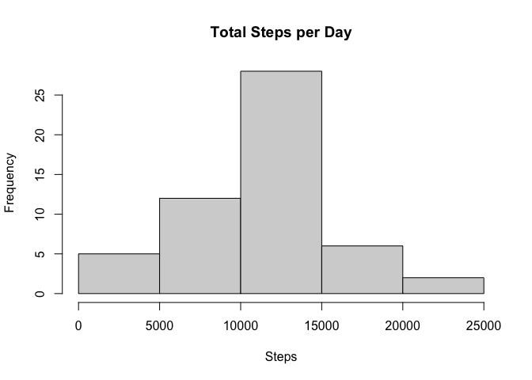
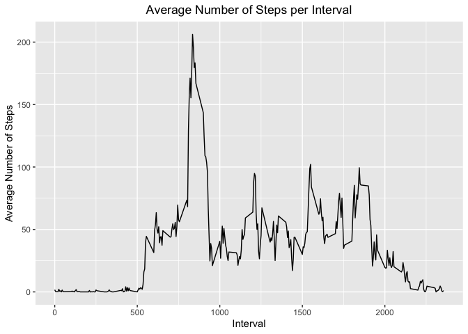
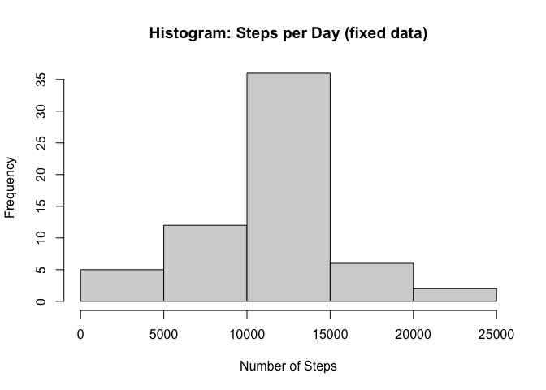
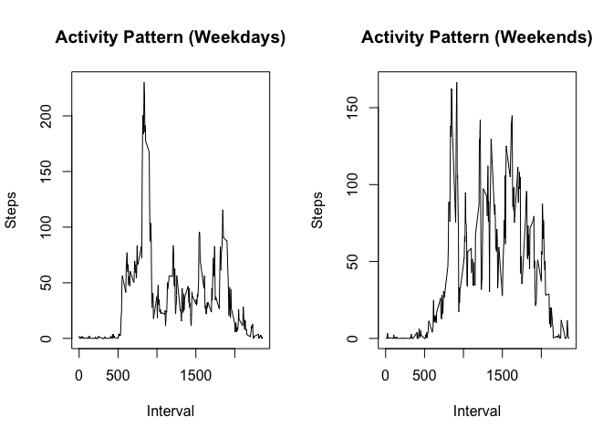

## Loading and preprocessing the data


```r
data <- read.csv("activity.csv")
data$DateTime <- as.POSIXct(data$date, format="%Y-%m-%d")

head(data)
```

```
##   steps       date interval   DateTime
## 1    NA 2012-10-01        0 2012-10-01
## 2    NA 2012-10-01        5 2012-10-01
## 3    NA 2012-10-01       10 2012-10-01
## 4    NA 2012-10-01       15 2012-10-01
## 5    NA 2012-10-01       20 2012-10-01
## 6    NA 2012-10-01       25 2012-10-01
```

## What is mean of total number of steps taken per day?


```r
# Calculate number of steps per day
daily_steps <- with(data, aggregate(steps~date, FUN=sum))
colnames(daily_steps) <- c("date", "steps")

# Create a histogram of total steps per day
hist(daily_steps$steps, xlab='Steps', main='Total Steps per Day')
```

<!-- -->

Calculate mean and median of the total number of steps taken per day

```r
# mean of daily steps
steps_mean <- mean(daily_steps$steps)
steps_mean
```

```
## [1] 10766.19
```

```r
#  median of daily steps
steps_median <- median(daily_steps$steps)
steps_median
```

```
## [1] 10765
```

The mean of the total number of steps taken per day is 10766 


The median of the total number of steps taken per day is 10765

## What is the average daily activity pattern?

Make a time series plot (i.e. type = "l") of the 5-minute interval (x-axis) and the average number of steps taken, averaged across all days (y-axis)


```r
# Load required libraries
library(ggplot2)
library(plyr)

# Create table of average steps per interval
avg_steps_interval <- ddply(data, .(interval), summarize, avg = mean(steps, na.rm=TRUE))

# Create line plot of average number of steps per interval
p <- ggplot(avg_steps_interval, aes(x=interval, y=avg), 
            xlab = "Interval", 
            ylab="Average Number of Steps")

p + geom_line() +
    xlab("Interval") +
    ylab("Average Number of Steps") +
    ggtitle("Average Number of Steps per Interval") + 
    theme(plot.title = element_text(hjust = 0.5))
```

<!-- -->

Which 5-minute interval, on average across all the days in the dataset, contains the maximum number of steps?


```r
# Max number of steps on an interval
maxsteps <- max(avg_steps_interval$avg)

# Get interval that contains maximum number of steps
avg_steps_interval[avg_steps_interval$avg==maxsteps, 1]
```

```
## [1] 835
```

## Imputing missing values


```r
# Calculate the total number of missing values in the dataset
missing_count <- nrow(data[is.na(data$steps),])
missing_count
```

```
## [1] 2304
```

Total number is missing data (i.e. steps is NA) is 2304 


Devise a strategy for filling in all of the missing values in the dataset:
The strategy is to find the average for each group of intervals, then replace
the NAs with the average.


```r
StepsPerInterval <- tapply(data$steps, data$interval, mean, na.rm = TRUE)

# split activity data by interval
data.split <- split(data, data$interval)

# fill in missing data for each interval
for(i in 1:length(data.split)){
    data.split[[i]]$steps[is.na(data.split[[i]]$steps)] <- StepsPerInterval[i]
}

# Create a new dataset that is equal to the original dataset 
# but with the missing data filled in.
data.fixed <- do.call("rbind", data.split)
data.fixed <- data.fixed[order(data.fixed$date) ,]

head(data.fixed)
```

```
##          steps       date interval   DateTime
## 0.1  1.7169811 2012-10-01        0 2012-10-01
## 5.2  0.3396226 2012-10-01        5 2012-10-01
## 10.3 0.1320755 2012-10-01       10 2012-10-01
## 15.4 0.1509434 2012-10-01       15 2012-10-01
## 20.5 0.0754717 2012-10-01       20 2012-10-01
## 25.6 2.0943396 2012-10-01       25 2012-10-01
```
Make a histogram of the total number of steps taken each day  


```r
steps_per_day <- tapply(data.fixed$steps, data.fixed$date, sum)
hist(steps_per_day, xlab = "Number of Steps", main = "Histogram: Steps per Day (fixed data)")
```

<!-- -->

Calculate the mean and median total number of steps taken per day


```r
steps_per_day.mean <- mean(steps_per_day, na.rm = TRUE)
steps_per_day.mean
```

```
## [1] 10766.19
```

```r
steps_per_day.median <- median(steps_per_day, na.rm = TRUE)
steps_per_day.median
```

```
## [1] 10766.19
```
The mean and median number of steps per day including replacing NAs data are 
10766.2 and 
10766.2, respectively. 

The mean remains the same as prior to replacing NAs, while the median value 
increased slightly.

## Are there differences in activity patterns between weekdays and weekends?


```r
data.fixed$weekday <- weekdays(data.fixed$DateTime) 

# Create a new factor variable in the dataset with two levels – 
# “weekday” and “weekend” indicating whether a given date is 
# a weekday or weekend day.
data.fixed$type_day <- factor((data.fixed$weekday) %in% c("Saturday", "Sunday"), 
         levels=c(TRUE,FALSE), labels=c('weekend', 'weekday')) 

# Calculate mean of steps per interval for weekends
StepsPerInterval.weekend <- tapply(data.fixed[data.fixed$type_day == "weekend" ,]$steps, 
                                   data.fixed[data.fixed$type_day == "weekend" ,]$interval, 
                                   mean, na.rm = TRUE)

# Calculate mean of steps per interval for weekdays
StepsPerInterval.weekday <- tapply(data.fixed[data.fixed$type_day == "weekday" ,]$steps, 
                                   data.fixed[data.fixed$type_day == "weekday" ,]$interval, 
                                   mean, na.rm = TRUE)

# Set a 2 panel plot
par(mfrow=c(1,2))

# Plot weekday activity
plot(as.numeric(names(StepsPerInterval.weekday)), 
     StepsPerInterval.weekday, 
     xlab = "Interval", 
     ylab = "Steps", 
     main = "Activity Pattern (Weekdays)", 
     type = "l")

# Plot weekend activity
plot(as.numeric(names(StepsPerInterval.weekend)), 
     StepsPerInterval.weekend, 
     xlab = "Interval", 
     ylab = "Steps", 
     main = "Activity Pattern (Weekends)", 
     type = "l")
```

<!-- -->
